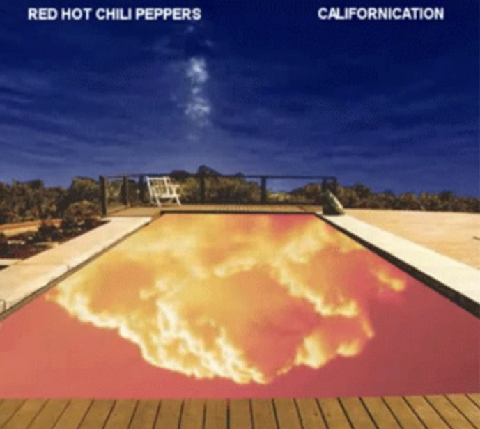
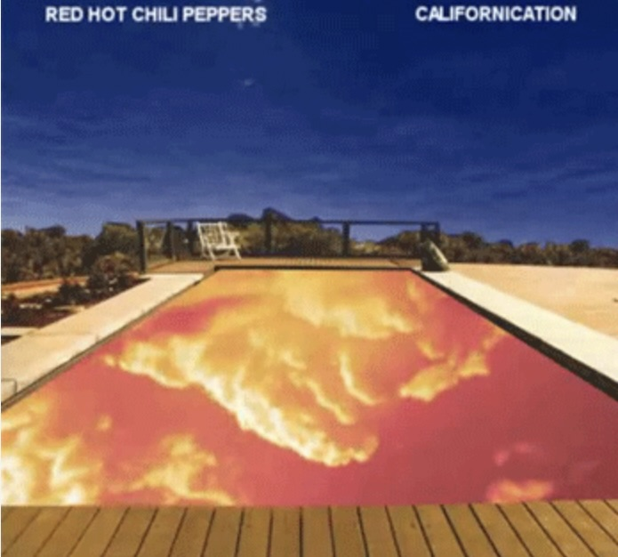

- ### Part 1 (Inspiration)

I have been inspired by an animated album cover from my favorite band. The album cover animates as music is being played. Certain parts of the artwork stay the same while other parts animate (the sky and the pool).

I would like to incorporate the audio animation from the Californiacation album cover into my project. It would be great if I could use sound to animate certain portions of the artwork based on the audio frequency. I believe this is a beneficial technique as the assignment mentions audio animation as one of the key methods we can choose from.

1. 
2. 

- ### Part 2 (Coding techniques)

  - Coding Technique
    - A coding technique that would assist would be FFT (Fast Fourier Transform) by using a p5.FFT object
    - FFT can map frequencies to specific elements that show up on the artwork image in real time. This could implement an animation where high frequencies animate a certain part of the artwork and low frequencies animate another part of the artwork. Each element of the artwork will animate based on the FFT output that is given. This would be a great technique to use if I am trying to animate the artwork to music. 

1. FFT in action
  - 
2. Example Code
  - [p5.js reference sheet (with code)](https://p5js.org/reference/#/p5.FFT)
  - [example of FFT impementation](https://github.com/Brayzen403/FastFourierTransform/commit/c3c37621e4ccb743ce370dc461e1d39915fe80ec)